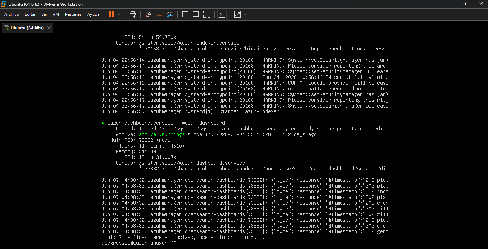
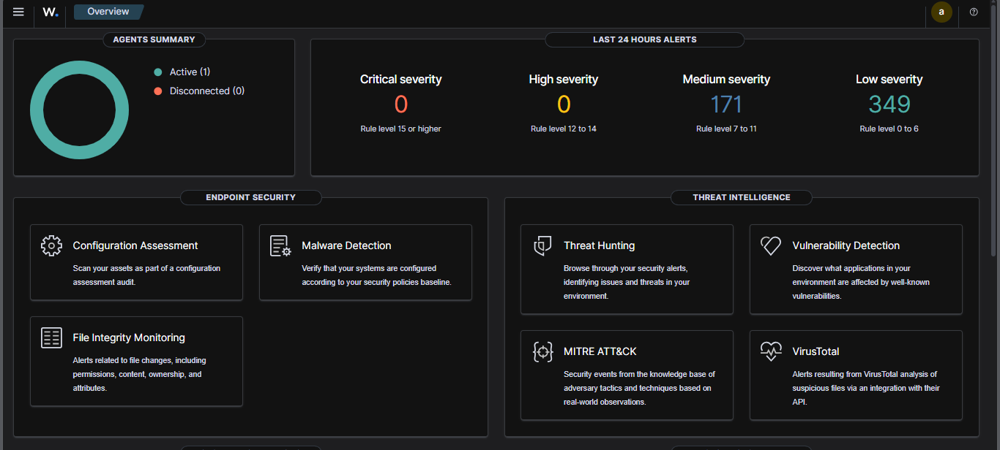
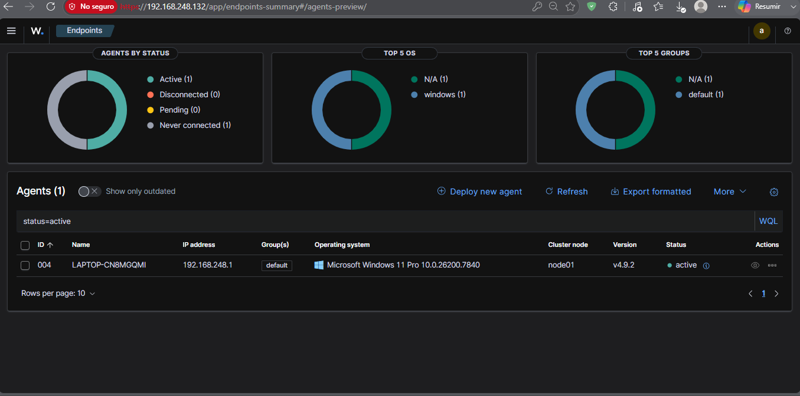
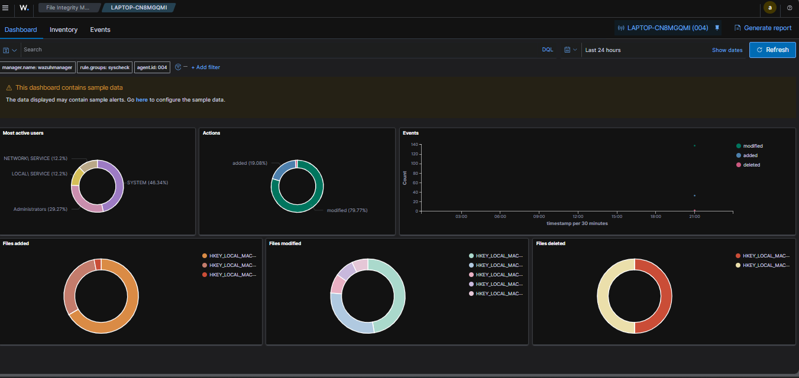
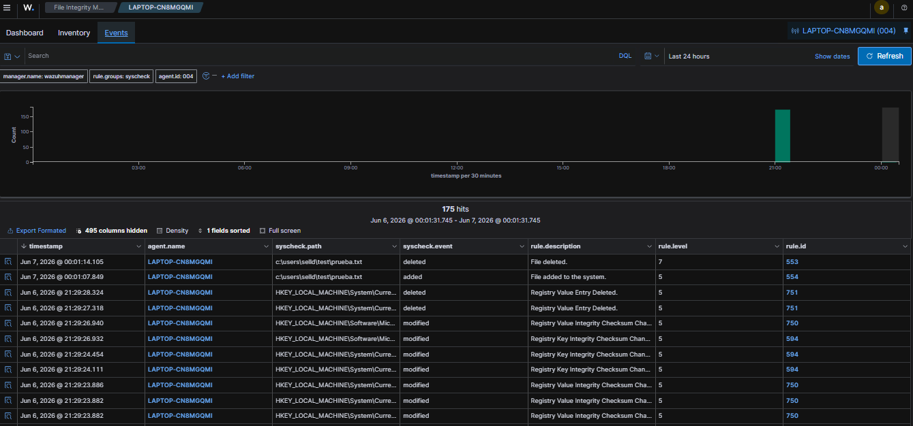
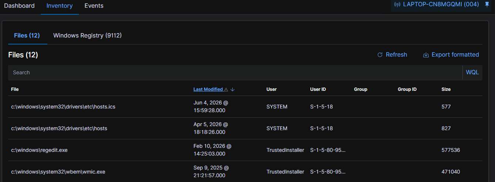
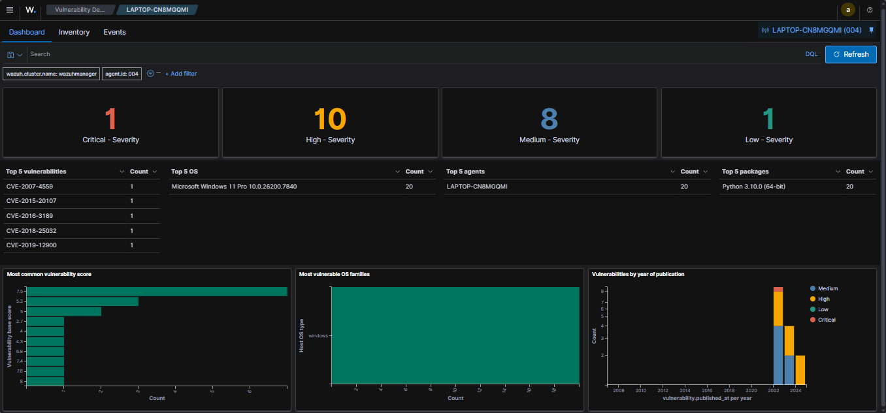
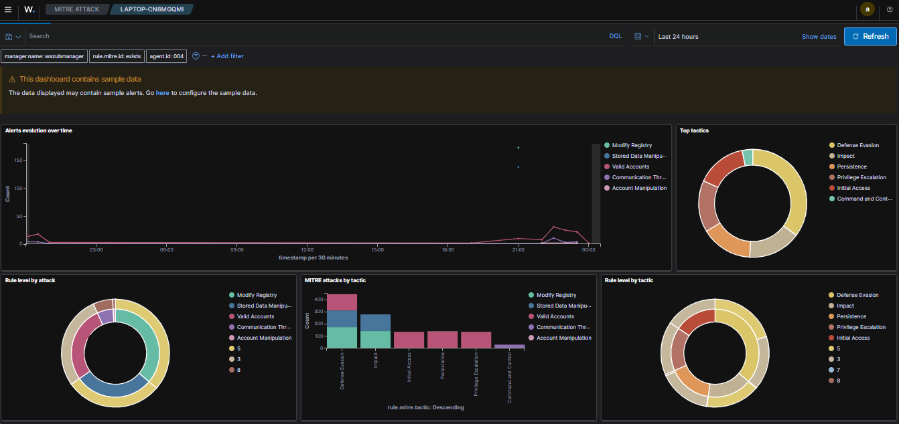
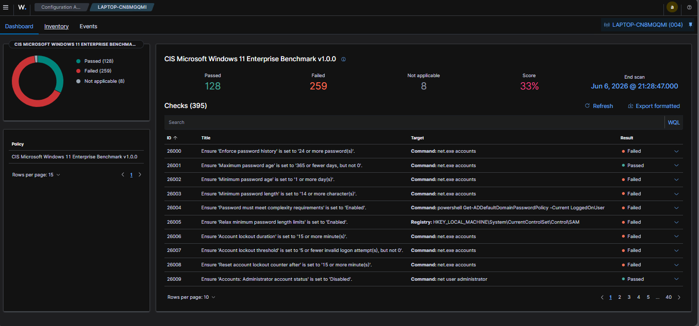

# Wazuh-SIEM-Homelab

## ✅ Objective 

This project demonstrates the deployment of a **Wazuh SIEM (Security Information and Event Management)** in a home lab environment using VMware Workstation. The lab covers the full setup of a Wazuh Manager on Ubuntu Server, agent deployment on a Windows 11 host, and real-time **File Integrity Monitoring (FIM)** using Wazuh's Syscheck module.

### Skills Learned

- Deploying a fully functional SIEM in a virtualized home lab environment 
- Configuring VMware NAT networking for VM-to-host communication 
- Installing and configuring Wazuh all-in-one stack on Ubuntu Server 
- Registering and authenticating Windows endpoints as Wazuh agents 
- Implementing real-time File Integrity Monitoring using Wazuh Syscheck 
- Analyzing security events through the Wazuh web dashboard

---

## 🧰 Technologies Used

- **Wazuh 4.9.2** — Open-source SIEM & XDR platform
- **Ubuntu Server 22.04 LTS** — Wazuh Manager host OS
- **Windows 11 Pro** — Monitored endpoint (Wazuh Agent)
- **VMware Workstation** — Virtualization platform
- **OpenSearch** — Wazuh Indexer backend
- **Wazuh Dashboard** — Web-based visualization interface

---

## ⚙️ Environment Setup

### Virtual Machine Specifications

| Parameter | Value |
|---|---|
| OS | Ubuntu Server 22.04.4 LTS |
| RAM | 4 GB |
| CPU | 2 cores |
| Storage | 50 GB (LVM) |
| Network | VMware NAT (VMnet8) |

### Prerequisites

- VMware Workstation installed
- Ubuntu Server 22.04 ISO
- Internet access on the VM
- Administrative access on Windows host

---

## 🏗️ Lab Architecture

```
┌─────────────────────────────────────────────────────────┐
│                     HOST MACHINE                         │
│                  Windows 11 Pro                          │
│              IP: 192.168.248.1                           │
│                                                          │
│   ┌──────────────────┐        ┌──────────────────────┐  │
│   │   Wazuh Agent    │        │   Web Browser        │  │
│   │   v4.9.2         │──────► │   Dashboard Access   │  │
│   │   (ossec-agent)  │        │   https://           │  │
│   └────────┬─────────┘        │   192.168.248.132    │  │
│            │                  └──────────────────────┘  │
│            │ VMware NAT (VMnet8)                         │
│            ▼                                             │
│   ┌──────────────────────────────────────────────────┐  │
│   │           VMware Virtual Machine                  │  │
│   │           Ubuntu Server 22.04 LTS                 │  │
│   │           IP: 192.168.248.132                     │  │
│   │                                                    │  │
│   │   ┌────────────┐ ┌───────────┐ ┌──────────────┐  │  │
│   │   │   Wazuh    │ │  Wazuh    │ │    Wazuh     │  │  │
│   │   │  Manager   │ │  Indexer  │ │  Dashboard   │  │  │
│   │   │            │ │(OpenSearch│ │  (port 443)  │  │  │
│   │   └────────────┘ └───────────┘ └──────────────┘  │  │
│   └──────────────────────────────────────────────────┘  │
└─────────────────────────────────────────────────────────┘
```

| Component | Host | IP | Role |
|---|---|---|---|
| Wazuh Manager | Ubuntu Server 22.04 (VMware) | 192.168.248.132 | Collects, analyzes and stores security data |
| Wazuh Agent | Windows 11 Pro (Host) | 192.168.248.1 | Sends logs and system events to the manager |

---

## 🚀 Step 1 — Wazuh Manager Installation

Ubuntu Server 22.04 was deployed in VMware Workstation and Wazuh was installed using the all-in-one script:

```bash
sudo apt-get update && sudo apt-get upgrade -y
curl -sO https://packages.wazuh.com/4.9/wazuh-install.sh && sudo bash wazuh-install.sh -a -i
sudo systemctl enable wazuh-indexer wazuh-manager wazuh-dashboard
```



---

## 🖥️ Step 2 — Wazuh Dashboard

After installation, the dashboard was accessed from the Windows host browser at `https://192.168.248.132`.



---

## 🔌 Step 3 — Windows Agent Deployment

The Wazuh agent was installed on the Windows 11 host and registered with the manager using an authentication key.

```powershell
msiexec /i "wazuh-agent-4.9.2-1.msi" WAZUH_MANAGER="192.168.248.132"
NET START WazuhSvc
```



---

## 🔍 Step 4 — File Integrity Monitoring (FIM)

The agent was configured to monitor a test folder in real time by editing `ossec.conf`:

```xml
<directories realtime="yes">C:\Users\Selld\Test</directories>
```

Files were created, modified, and deleted in the monitored folder to generate FIM events.







---

## 🛡️ Step 5 — Vulnerability Detection

Wazuh automatically scanned the Windows endpoint and detected vulnerabilities by CVE severity.



---

## ⚔️ Step 6 — MITRE ATT&CK Integration

Wazuh mapped detected events to MITRE ATT&CK tactics including Defense Evasion, Persistence, and Privilege Escalation.



---

## 📋 Step 7 — CIS Benchmark (Security Configuration Assessment)

Wazuh ran a CIS Microsoft Windows 11 Enterprise Benchmark assessment against the endpoint, scoring 33% (128 passed / 259 failed out of 395 checks).



---

## 📁 Project Structure

```
Log-Analysis-Lab/
├── screenshots/
│   ├── agent-active.png
│   ├── cis-benchmark.png
│   ├── dashboard-overview.png
│   ├── file-inventory.png
│   ├── fim-dashboard.png
│   ├── fim-events.png
│   ├── mitre-attack.png
│   ├── services-running.png
│   └── vulnerability-detection.png
├── configs/
│   └── ossec-agent.conf
├── installation/
│   └── Steps
├── LICENSE
└── README.md
```

---

## 👤 Author

**alexrepsec**  
Cybersecurity enthusiast | Home Lab Builder  

*This project was built as part of a cybersecurity portfolio to demonstrate practical SIEM deployment and endpoint monitoring skills.*
